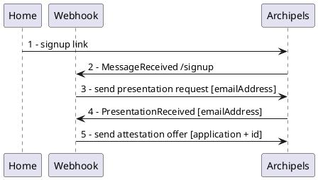
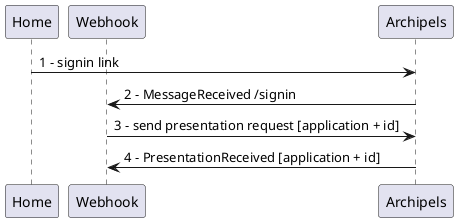

# 01 - Authentication

This example is a **modern**, **secure**, and **privacy-focused** authentication mechanism designed to replace traditional login methods (e.g., usernames and passwords).

By leveraging decentralized identity wallets, you can provide a seamless and secure way for users to authenticate across websites and apps without relying on centralized databases for storing personal credentials.

## Try it out!

Check out the demo live on our website: [demo.archipels.io/authentication](https://demo.archipels.io/authentication)!


## Setting it up locally

This section will help you set up a website where users can sign up and log in without using a password.

By modifying the source code, you can then easily integrate this functionality on a website of your own.

If you're interested in the benefits provided by this approach, as well as some more technical background, scroll down to [the appendix](#key-benefits). If you prefer seeing code in action to understand it, keep on reading!

### Getting started

First, make sure you've created a wallet to represent your website when users try to authenticate on it. To do this, you can follow the [Getting started guide](../README.md).

Before going further, you should have a wallet and an `ACCESS_TOKEN` to access it.

Now, clone this repository and move to the next step!

> Set your `ACCESS_TOKEN` as an environment variable or change it in the `src/constants.js` file.

### Tunneling your localhost

When running **locally**, we will use tunneling to allow users to call back your application. You can use any available solution, in this example we will use [ngrok](https://ngrok.com/docs/getting-started/):

```shell
ngrok http localhost:5001
```

This will give you the URL your website will be available at. Set it as an environment variable or change it in the `src/constants.js` file.

> When deploying on your own domain, you can skip the tunneling step, but don't forget to set the `APP_URL` to your website's URL.

### Installation

Select the directory `authentication` and install the dependencies:

```shell
npm ci
```

### Start the demo

To start the demo:

```shell
npm run start
```

Now, visit your app's URL to see the magic in action!
You may have to use another browser or clear your cookies to simulate a distinct user.

Alternatively, you can also use the provided Dockerfile to run the demo in a container.

## Workflow

The demo is composed of two main steps, the `signup` and `signin`.

### Signup



#### Explanation :

1. A user click on your signup invitation link and is redirected to our web application
2. You receive a message to start the signup process
3. Send him a request to present a verified email address
4. You receive a presentation containing the requested data
5. Send him back an attestation offer with your custom schema

> **Important :** when you receive a presentation, validate each presentation attribute issuer to ensure that you can trust the source of the data (Cf. method `validatePresentationIssuer` in helpers).

User can accept your attestation offer to add it to his personal wallet for future signin process

### Signin
 


#### Explanation :

1. A user click on your signin invitation link and is redirected to our web application
2. You receive a message to start the signin process
3. Send him a request to present a verified id and application name (Cf. create custom schema)
4. You receive a presentation containing the requested data

> **Important :** when you receive a presentation, validate each presentation attribute issuer to ensure that you can trust the source of the data (Cf. method `validatePresentationIssuer` in helpers).

You can now do whatever you want, validate the email, generate a private access token to authenticate the user on your own api, etc...

### Feeling lost?

If you're not familiar with SSI (Self-Sovereign Identity), you might feel a little overwhelmed with unknown terms.
That's normal! It represents a paradigm shift away from centralized identity (our ID cards are delivered by a central state) and IDPs (IDentity Providers, intermediaries like Google or Facebook we trust with our personal information when we log in without creating an account on a website).

But don't worry, the basic concepts are simple enough to grasp.
To authenticate without a password and without intermediaries, you establish a secure connection between your app's wallet and the wallet of your user.

> A wallet is, like in real life, a collection of stuff (only digital).

In this case, when your user first signs in, you first request an email attestation the user has in their wallet. We call them the _holder_ and you the _verifier_. _Attestations_, or _verifiable credentials_ are what holders hold in their wallets.

Most likely, the user already has one in this case. If not, they can request one from an _issuer_ (Archipels for example).

Once they present it, you (the verifier) check that you trust the issuer. If you do, you now know that your user's email address is valid.


You then issue another attestation, which we call the demo attestation in this example. This is what your user will use to authenticate themselves. You become an issuer yourself.

When they try to sign in again, you take the role of verifier and ask for the attestation you issued. If the user provides it, they're logged in! You can then handle the user's account as you would otherwise.

When the user presents an attestation, the protocols behind guarantee that it has not been falsified, has not been tampered with and has indeed been issued by the issuer it claims. The technology allows us to think about the only question that really matters:

> Do I trust the issuer, that is, do I trust the human behind it?

For more benefits of this new approach, see the [appendix](#key-benefits).

What we now need is a way of requesting an attestations. To do this, we use _schemas_, which are simply attestation blueprints. They indicate which attributes it should contain:

```json
// (Archipel's) email schema
{
  "id": "dfe18fd1-182c-45f5-8d84-a200994e5ac9",
  "schemaId": "QuS72Sdp6eDD2jTDz43XoU:2:Email attestation:1.0",
  "name": "Email attestation",
  "attributes": [
    {
      "name": "emailAddress",
      "description": "Email"
    }
  ],
  // ...
}
```

Anyone can create schemas for others to issue and request attestations. This gives holders tremendous power, leading to a much more decentralized structure.

One final concept we need to understand are _connections_. This is the way you connect with all the actors. To initiate a secure communication channel between you and your user, we use invitations, which you can add to your website. When a user clicks one one such invitation, Archipels creates a secure connection between your wallets. It is then used to issue and verify attestations.

That's it! With this, you should understand all the building blocks of this example. If you want to dig deeper, these resources are great introductions to the subject (taken from this [great repo](https://github.com/animo/awesome-self-sovereign-identity)):
- [Self-Sovereign Identity (SSI) Explained](https://www.youtube.com/watch?v=kJAapPG_jBY) (video)
- [Self-Sovereign Identity: Decentralized digital identity and verifiable credentials](https://livebook.manning.com/book/self-sovereign-identity/welcome/) (book)
- [Introduction to Self-Sovereign Identity](https://walt.id/white-paper/self-sovereign-identity-ssi) (article)

Of course, you can use any other wallet alternative that uses the same protocol instead of Archipels. But why not use one of the most feature-rich options, which actively works with many industry giants and most SSI actors, while also being completely free for individual wallets? Discover more on [our website](https://www.archipels.io/)!

## Want to go further?

If you want to dig deeper in this example, here are a few steps you can take:
1. [Ask for a different attestation](#ask-for-a-different-attestation)
2. [Discover how invitations are resolved](#discover-how-invitations-are-resolved)
3. [Create a custom schema](#create-a-custom-schema)
4. [Check out our docs](#check-out-our-docs)

### Ask for a different attestation

To ask the user for a different attestation, simply modify the `ATTESTATION_SCHEMA_ID` to choose the schema you want to use. You can also [create your own schema](#create-a-custom-schema). If you don't want to ask the user for an attestation on signup, simply remove the checks `index.js` and `helpers.js`.

### Discover how invitations are resolved

When calling the /connections/create-invitation, you receive an invitation, encoded as a JWT token. If you want to sent it to your users without forcing them to make API calls, simply embed it in a link:

https://app.archipels.io/presentation-requests/initialize?message=${message}&invitation=${invitation}

After clicking the link, the user will be redirected to select a wallet they want to use (or create one if they don't have one yet). Once authenticated, it will send the message you specified back to the owner (you). In this app, we use it to send /signup and /signin commands in the chat, but you can customize it!

### Create a custom schema

Use our api to create a schema :

```curl
curl --location 'https://app-api.archipels.io/schemas' \
--header 'wallet: {WALLET_DID}' \
--header 'Content-Type: application/json' \
--header 'Authorization: Bearer {ACCESS_TOKEN}' \
--data '{"owner":"demo","public":true,"tags":["demo"],"description":"demo","attributes":[{"description":"demo application","name":"application"},{"description":"demo id","name":"id"}],"name":"Demo","version":"0.1"}'
```

> **Notes :** In this schema, we are defining two attributes `application` and `id`.

You will receive the following response format :

```json
{
  "id": "25a086d5-966d-4963-bedb-d953db8cb713",
  "schemaId": "C8kQSU4bHyh1A2YvQ9TyLU:2:Demo:0.1",  // <-- The schema id
  "name": "Demo",
  "version": "0.1",
  "attributes": [
    {
      "name": "application",
      "description": "demo application"
    },
    {
      "name": "id",
      "description": "demo id"
    }
  ],
  "description": "demo",
  "tags": ["demo"],
  "public": true
}
```

Then, in `src/constants.js`:
- If you want to use this schema to represent your users, set the value of `DEMO_SCHEMA_ID` to your new schema id. You will also need to modify the code in `helpers.js` to generate the attestation correctly.
- If you want to use this schema for validating users before sign in, set the `ATTESTATION_SCHEMA_ID` property. However, note that you are most likely the only verifier who will agree to deliver such attestations, which does defeat the purpose.

### Check out our docs

For a more general reference about our APIs, make sure to check out our [documentation](https://docs-v1.archipels.io/archipels-documentation)!

## Key Benefits
-   **Enhanced Security:** With decentralized identity wallets, users' sensitive information remains in their control. This reduces the risk of data breaches and unauthorized access to personal data.

-   **Easy Integration:** Our solution is designed to be easily integrated into existing websites and applications, with minimal setup required. Whether you're building an app or running a website, you can get started quickly with our clear documentation and example code.

-   **Customizable:** The authentication mechanism is highly flexible, allowing developers to tailor the solution to fit the specific needs of their platform. Sign-up requirements can be customized to fit your project and Login attestation can include any attribute that you may need to manage roles and permissions for your project.

-   **User-Centric:** Users remain in full control of their digital identity, choosing how and when to share their information, creating a more privacy-respecting experience.

## Additional details

### Directory structure

In this directory you will find a `public` directory for assets, a `views` directory for the main template and `src` directory containing the javascript source files :

- constants: contains all constant for Archipels and your config
- helpers: utility methods
- http: configured Axios instance
- index: express app with middlewares, routes, etc...
- setup: A default setup that reduces the number of manual steps. Can be skipped once you are building your own implementation 
